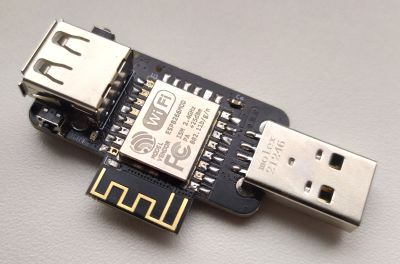
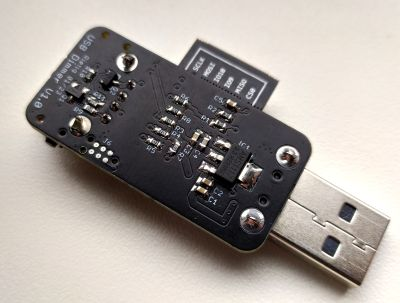

# Tasmodul USB-Dimmer
A plug-in dimmer for USB powered lamps and lights to be used with Tasmota, WLED or custom ESP8266 firmwares.

## Features
* Small formfactor (21x42mm without USB)
* Up to 2A output current (approx.)
* 2 buttons for user interfacing

## Configuration
* GPIO4: Inverted PWM output (or switch)
* GPIO5: Inverted push button "DOWN"
* GPIO13: Inverted push button "UP"
* GPIO0: Inverted LED indicator